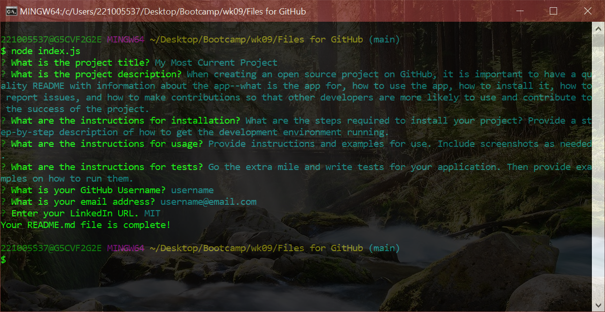

# Readme Generator


[](https://opensource.org/licenses/MIT)

## Description

A command-line application will allow for quick and easy generation of a project README to get started quickly.

## Table of Contents

* [Installation](#installation)
* [Usage](#usage)
* [Contributing](#contributing)
* [Tests](#tests)
* [Questions](#questions)
* [License](#license)

## Installation

Follow the steps outlined in this [instructional video](./assets/images/walkthru.webm).

Note that it is using the [Inquirer package](https://www.npmjs.com/package/inquirer).

```
node index.js
```

## Usage

The following image shows the web application's appearance and functionality:



## Contributing

The [Contributor Covenant](https://www.contributor-covenant.org/) is an industry standard to use for contributing.

## Tests

Try emulating the steps outlined in the instructional video linked above.

## Questions

* Ask a question on [GitHub](https://github.com/anthonyhermann)

## License

© 2020 All Rights Reserved.

Licensed under the MIT license.
